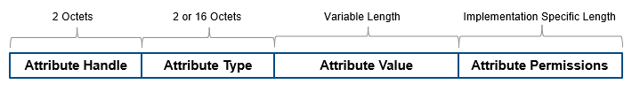

# The-BLE-protocol-stack
The Bluetooth low energy protocol stack (or protocol stack) consists of the controller and the host. This separation of controller and host derives from the implementation of classic Bluetooth BR/EDR devices, where the two sections are implemented separately.

The ble protocol stack have the following components:

    physical layer
    link layer
    logical link control and adaptation layer
    att
    Gatt
    GAP
    security manager

The physical layer (PHY) is a 1-Mbps adaptive frequency-hopping GFSK (Gaussian frequency-shift keying) radio operating in the unlicensed 2.4-GHz ISM (industrial, scientific, and medical) band.

The link layer is the layer that interfaces with the physical layer (radio) and provides the
higher-level layers an abstraction and a way to interact with the radio (through an
intermediary level called the HCI layer which weʼll discuss shortly).

The HCI layer provides communication between the host and controller through a standardized interface. This layer can be implemented either through a software API or by a hardware interface such as UART, SPI, or USB. The Specification of the Bluetooth System describes Standard HCI commands and events. TI’s proprietary commands and events are specified in TI Bluetooth low energy Vendor-Specific HCI Reference Guide.

The L2CAP layer provides data encapsulation services to the upper layers, allowing for logical end-to-end communication of data.

ATT.   The ATT transfers attribute data between clients and servers in GATT-based profiles. The ATT defines the roles of the client-server architecture. The roles typically correspond to the master and the slave as defined in the link layer. In general, a device could be a client, a server, or both, irrespective of whether it is a master or a slave. The ATT also performs data organization into attributes as shown in this figure.

 
Device attributes are represented as:

    The attribute handle is a 16-bit identifier value assigned by the server to enable a client to reference those attributes.

    The attribute type is a universally unique identifier (UUID) defined by Bluetooth SIG. For example, UUID 0x2A37 represents a heart-rate measurement.

    The attribute value is a variable length field. The UUID associated with and the service class of the service record containing the attribute value, determine the length of the attribute value field.

    Attribute permissions are sets of permission values associated with each attribute. These permissions specify read and write privileges for an attribute, and the security level required for read and write permission.

GATT.  The GATT provides a reference framework for all GATT-based profiles. The GATT encapsulates the ATT and is responsible for coordinating the exchange of profiles in a BLE link. Profiles include information and data such as handle assignment, a UUID, and a set of permissions.

For devices that implement the GATT profile,

    The client is the device that initiates commands and requests toward the server. The client can receive responses, indications, and notifications.

    The server is the device that accepts incoming commands and requests from the client. The server sends responses, indications, and notifications to the client.

The GATT uses client-server architecture. The roles are not fixed and are determined when a device initiates a defined procedure. Roles are released when the procedure ends.

The terminology used in the GATT includes:

    Service — A collection of data and associated behaviors used to accomplish a particular function or feature

    Characteristic — A value used in a service along with appropriate permissions

    Characteristic descriptor — A description of the associated characteristic behavior

    GATT-Client — A GATT-Client initiates commands and requests towards the server and can receive responses, indications, and notifications sent by the server

    GATT-Server — A GATT-Server accepts incoming commands and requests from a client and sends responses, indications, and notifications to the client

The Security Manager layer defines the methods for pairing and key distribution, and provides functions for the other layers of the protocol stack to securely connect and exchange data with another device.

The Generic Access Profile (GAP) controls the RF state of the device, with the device in one of five states:

    Standby
    Advertising
    Scanning
    Initiating
    Connected

Advertisers transmit data without connecting, while scanners scan for advertisers. An initiator is a device that responds to an advertiser with a request to connect. If the advertiser accepts the connection request, both the advertiser and initiator enter a connected state. When a device is connected, it connects as either master or slave. The device initiating the connection becomes the master and the device accepting the request becomes the slave.
The Generic Access Profile (GAP) layer directly interfaces with the application and/or profiles, to handle device discovery and connection-related services for the device. GAP handles the initiation of security features.

references
http://software-dl.ti.com/lprf/simplelink_cc2640r2_sdk/1.00.00.22/exports/docs/blestack/html/ble-stack/index.html#bluetooth-low-energy-protocol-stack-basics
https://www.mathworks.com/help/comm/ug/bluetooth-protocol-stack.html