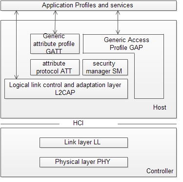

# The-BLE-protocol-stack
The Bluetooth low energy protocol stack (or protocol stack) consists of the controller and the host. This separation of controller and host derives from the implementation of classic Bluetooth BR/EDR devices, where the two sections are implemented separately.

The ble protocol stack have the following components:

    physical layer
    link layer
    logical link control and adaptation layer
    att
    Gatt
    GAP
    security manager

The physical layer (PHY) is a 1-Mbps adaptive frequency-hopping GFSK (Gaussian frequency-shift keying) radio operating in the unlicensed 2.4-GHz ISM (industrial, scientific, and medical) band.

The link layer is the layer that interfaces with the physical layer (radio) and provides the
higher-level layers an abstraction and a way to interact with the radio (through an
intermediary level called the HCI layer which weʼll discuss shortly).

The HCI layer provides communication between the host and controller through a standardized interface. This layer can be implemented either through a software API or by a hardware interface such as UART, SPI, or USB. The Specification of the Bluetooth System describes Standard HCI commands and events. TI’s proprietary commands and events are specified in TI Bluetooth low energy Vendor-Specific HCI Reference Guide.

The L2CAP layer provides data encapsulation services to the upper layers, allowing for logical end-to-end communication of data.

The ATT layer allows a device to expose certain pieces of data or attributes, to another device. The Generic Attribute Profile (GATT) layer is a service framework that defines the sub-procedures for using ATT. Data communications that occur between two devices in a Bluetooth low energy connection are handled through GATT sub-procedures. The application and/or profiles will directly use GATT.

The Security Manager layer defines the methods for pairing and key distribution, and provides functions for the other layers of the protocol stack to securely connect and exchange data with another device.

The Generic Access Profile (GAP) controls the RF state of the device, with the device in one of five states:

    Standby
    Advertising
    Scanning
    Initiating
    Connected

Advertisers transmit data without connecting, while scanners scan for advertisers. An initiator is a device that responds to an advertiser with a request to connect. If the advertiser accepts the connection request, both the advertiser and initiator enter a connected state. When a device is connected, it connects as either master or slave. The device initiating the connection becomes the master and the device accepting the request becomes the slave.
The Generic Access Profile (GAP) layer directly interfaces with the application and/or profiles, to handle device discovery and connection-related services for the device. GAP handles the initiation of security features.

