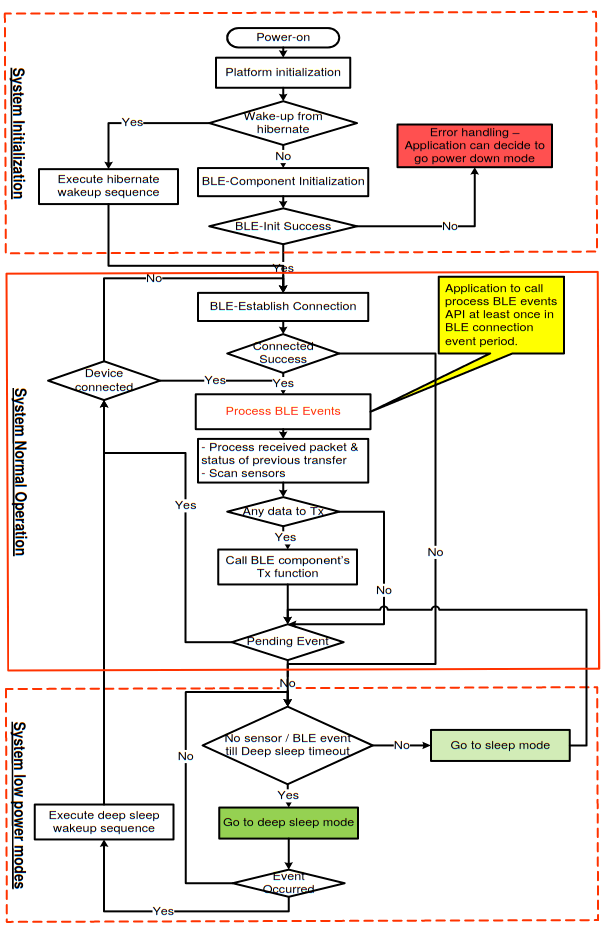

Developing a Bluetooth Low Energy Application

# Introduction

There are two possible configurations you can use to build your Bluetooth low energy application
- BLE software runs in a configuration in which the application is mounted on BLE SOC 
- the application is mounted on another MCU. In this case, APP-MCU and BLE-MCU communicate through a serial interface.
In both of previous cases, a developer must understand the functionality of the various protocol stack layers and how they interact with the application and profiles.

# BLE protocol stack API

BLE SoC fabricator will give documentation of the api used to interact with the BLE protocol stack. You will find it with a name similar to this one "ble protocol stack api reference manual".
This manual describes the  API  (Application  Program  Interface)  of the different components of the  Bluetooth  Low  Energy protocol stack (BLE software). It is intended for users designing and developing Bluetooth applications. Basic knowledge of Bluetooth low energy and microcontrollers is necessary to use this manual.

## GAP API

Say we want to write a sample application that performs advertising (Peripheral), scanning, and establishing a connection (Central) by using GAP API provided by the BLE protocol stack. GAP API will give functions to set advertising parameters, enable advertising, search devices and create connection. This sequence chart explains the use of the GAP API.

  

## GATT Database and GATT API

Add the service and characteristic value to the GATT database depends of the product you are using. you should take a look at the documentation and understand how they are implementing GATT database creation and updating.

In GATT, the following procedures are defined for exchanging data exposed on the server.  
- Discover services exposed by the server from a client  
- Discover characteristics exposed by the server from a client 
- Discover characteristic descriptors exposed by the server from a client 
- Read characteristic values exposed by the server from a client (Read) 
- Write characteristic values exposed by the server from a client (Write) 
- Read the characteristic configuration descriptor exposed on the server from a client (Read) 
- Write the characteristic configuration descriptor on the server from a client (Write) 
- Indicate characteristic values from the server to a client (Indication) (with verification of reception from the client to the server) 
- Notification of characteristic values from the server to a client (Notification) 

## BLE parameters configuration
BLE stack API will let you also set the BLE parameters. 
When developing BLE projects you should be careful when configuring advertising parameters and connection parameters. In this section, we will define these parameters and explain their impact on communication.

### BLE Advertising parameters
BLE allows a wide range of setting parameters for advertising and scanning events, as shown in
Figure 1 and Figure 2. The advertisement interval is the time between two consecutive advertising events minus the time of advertisement delay . The advertisement interval can be of any value in between 20 𝑚𝑠 to 10.24 𝑠. The value of The advertisement interval should always be a multiple of 0.625𝑚𝑠. However, there is a restriction on the event types, scannable undirected and non-connectable undirected, the value of The advertisement interval cannot be less than 100 𝑚𝑠. The advertisement delay is a pseudo-random value that ranges between 0 to 10 𝑚𝑠.

  

  

There are four advertising event types. Each one corresponds to an advertising PDU type.
Some allow a response from the scanner, some from the initiator, and some do not allow the advertiser to scan its channels to receive data. The device is said to be a scanner when its link layer is in the scanning state. Like the advertiser, it listens to each advertising channel index. The duration for which the scanner listens to the channel is called a scan window denoted by TScanWindow. The scan interval is
the time interval between two scan windows, it is denoted by TScanInterval. Both the values of TScanWindow and TScanInterval should be less than or equal to 10.24 s. If both values are equal, then the scanning mode becomes continuous. The continuous scanning mode drains the battery; hence it is discouraged but as per specifications it can be implemented. The initiating state works in the same way as scanning state, the only difference is that devices in both states respond to distinct advertising packets and a connection is established after the interaction of advertiser with initiator.

### BLE Connection parameters

The connection parameters for a BLE connection is a set of parameters that determine when and how the Central and a Peripheral in a link transmits data. It is always the Central that actually sets the connection parameters used, but the Peripheral can send a so-called Connection Parameter Update Request, that the Central can then accept or reject.

There are basically three different parameters:

- Connection interval: Determines how often the Central will ask for data from the Peripheral. When the Peripheral requests an update, it supplies a maximum and a minimum wanted interval. The connection interval must be between 7.5 ms and 4 s.
- Slave latency: By setting a non-zero slave latency, the Peripheral can choose to not answer when the Central asks for data up to the slave latency number of times. However, if the Peripheral has data to send, it can choose to send data at any time. This enables a peripheral to stay sleeping for a longer time, if it doesn't have data to send, but still send data fast if needed. The text book example of such device is for example keyboard and mice, which want to be sleeping for as long as possible when there is no data to send, but still have low latency (and for the mouse: low connection interval) when needed.
- SConnection supervision timeout: This timeout determines the timeout from the last data exchange till a link is considered lost. A Central will not start trying to reconnect before the timeout has passed, so if you have a device which goes in and out of range often, and you need to notice when that happens, it might make sense to have a short timeout.

### impact of BLE parameters on the communication

- Advertising Parameters: Fast and Slow advertising terms are commonly used for describing advertising rates. For fast advertising the advertising interval is lower, therefore the probability of the device discovery is higher, hence higher power consumption. For slow advertising, the advertising interval is higher, the probability of the device discovery is lower, hence lower power consumption. Advertising beacons utilize complete payload. Connection dependent devices may or may not require to utilize full payload, only necessary information can be advertised.
- Connection Parameters: A peripheral might advertise preferred connection parameters. The central device may establish a connection within the preferred parameters. Not all devices require high throughput, for these devices the connection interval could be higher, hence lower power consumption. For bulk data transfers higher throughput is suitable, therefore lower connection interval is preferred, hence higher power consumption.
Radio Power Level: The range of communication is dependent on the power level, distance, and line of sight. By tuning the power level one could optimize the required power level based on the signal strength between the devices.

# Typical application code

A typical application code consists of three separate stages: Initialization, Normal operation, and Low power operation

  

Once the Component is initialized, it enters normal operation and periodically enters various
degrees of low power operation to conserve power. Hence initialization should only happen at
system power-up, and the Component should operate between normal mode and low power
mode afterwards.
- System Initialization
The initialization stage happens at system power-up or when waking from system hibernation.
This stage sets up the platform and the Component parameters. The application code should
also start the Component and set up the callback functions for the event callbacks that will
happen in the other modes of operation.
- System Normal Operation
Upon successful initialization of the BLE Component or hibernate wakeup sequence, the
Component enters normal mode. Normal operation first establishes a BLE connection if it is not
already connected. It should then process all pending BLE events by checking the stack status.
This is accomplished by calling CyBle_ProcessEvents(). When all events have been processed,
it can transmit any data that need to be communicated and enters low power operation unless
there is another pending event. In such a case, it should execute the normal operation flow
again. Processing of BLE events should be performed at least once in a BLE connection event
period. The BLE connection event is configured by application using the customizer.
- System Low power Operation
When there are no pending interrupts in Normal operation, the Component should be placed in
low power mode. It should first enter sleep mode. After a certain application defined timeout, you may place the Component in Deep Sleep Mode. If an event happens at any time in low power
mode, it should re-enter normal operation.

# References

https://www.infineon.com/dgdl/Infineon-Component_BLE_v2.20-Software+Module+Datasheets-v03_66-EN.pdf?fileId=8ac78c8c7d0d8da4017d0eadd1fd2988&utm_source=cypress&utm_medium=referral&utm_campaign=202110_globe_en_all_integration-files

https://www.renesas.com/eu/en/document/apn/bluetooth-low-energy-protocol-stack-embedded-configuration-sample-program

https://devzone.nordicsemi.com/f/nordic-q-a/28058/what-is-connection-parameters

Article: Efficient Advertiser Discovery in Bluetooth Low Energy Devices
Seung Whan Song, Youn Sang Lee, Fatima Imdad, Muhammad Tabish Niaz and
Hyung Seok Kim